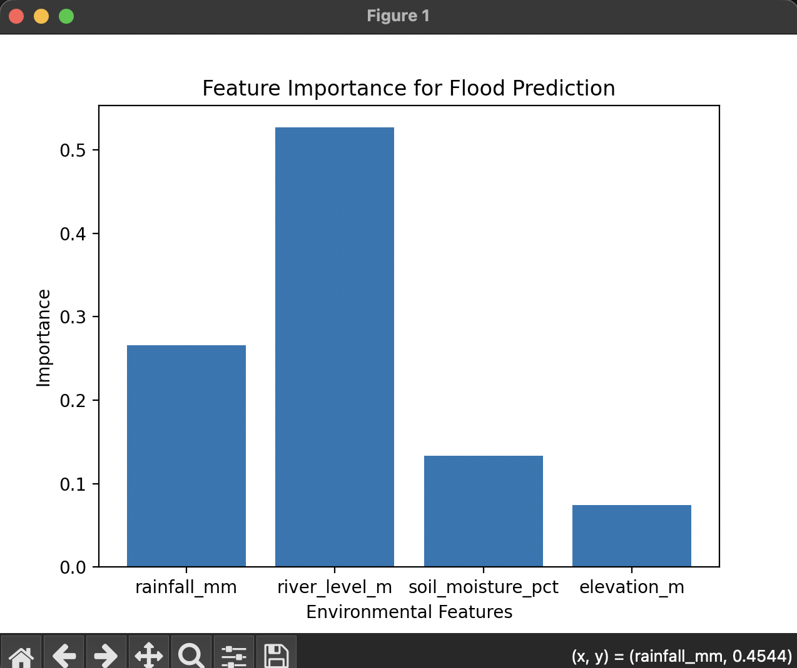
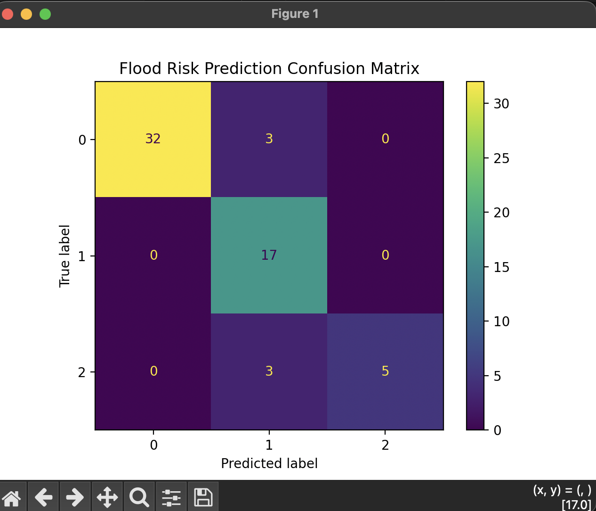
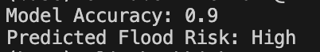

# AI-Flood-Risk-Prediction

I am creating a poster for the BCSWoman Lovalace Colloquium. This si a current trained base model
for predicting flood risk based on synethetically generated values. In the future, I would want to use real data.

*(Note: Poster will be added here after the event, for more informaiton on my proposed topic)*

## Current results from code: 

A Random Forest Classifier was used to generate a trained model using 300 generated values, using an 80/20 training/testing split. 
____________________________________________
### Feature Analysis Bar Chart:

- Feature analysis revealed that river level was the dominant factor (importance: 0.52), followed by rainfall (0.27), soil moisture (0.13), and elevation (0.08).
__________________________________________________________________
### Confusion Matrix:

- Showed how accurate the predictions were. There seemed to be no sigificant misclassifications except a few between medium and high risk boundary.

________________________________________________________________________________________
### Terminal output:

- Achieved an accuracy of 90% on unseen test data. 

Thank you for looking at my repository <3!
